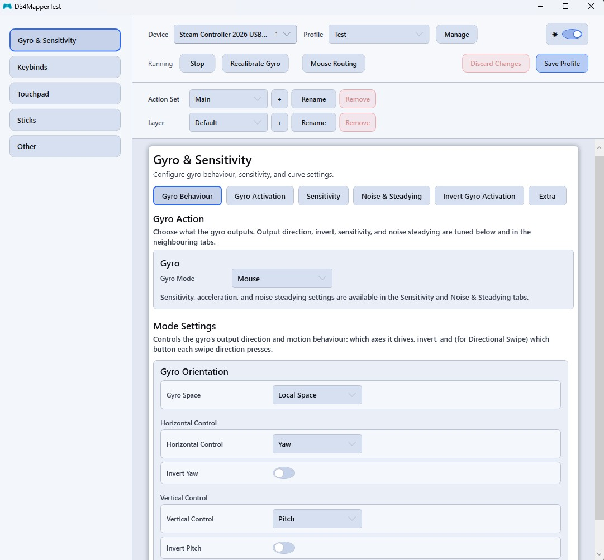
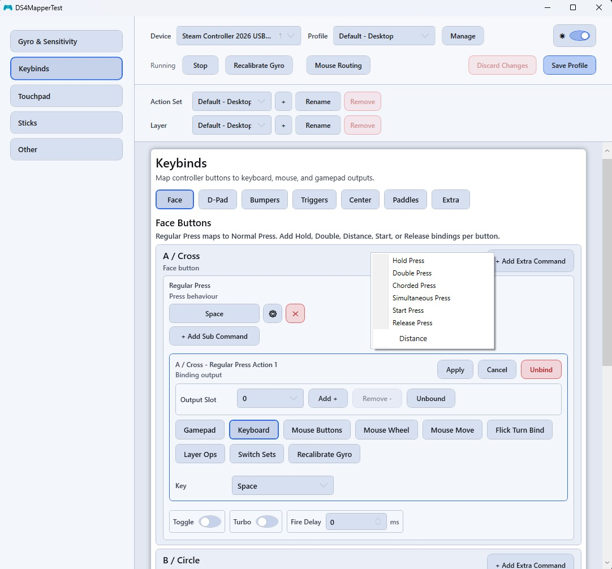
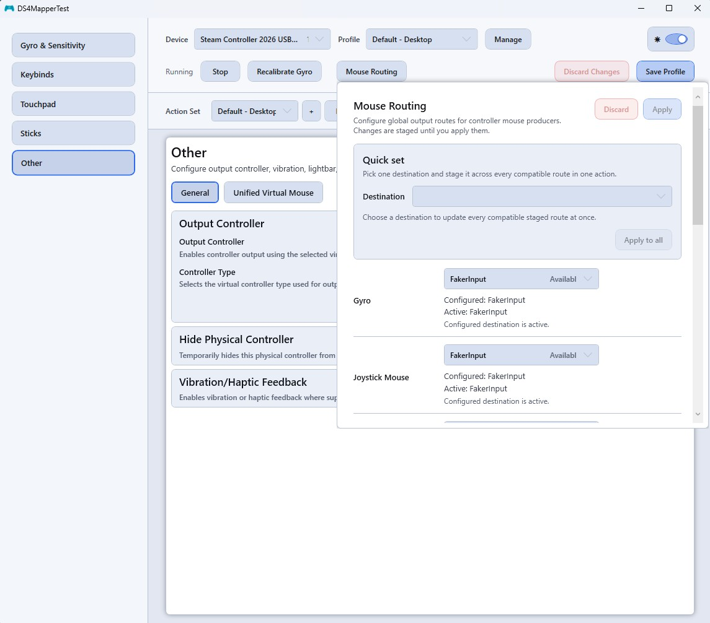
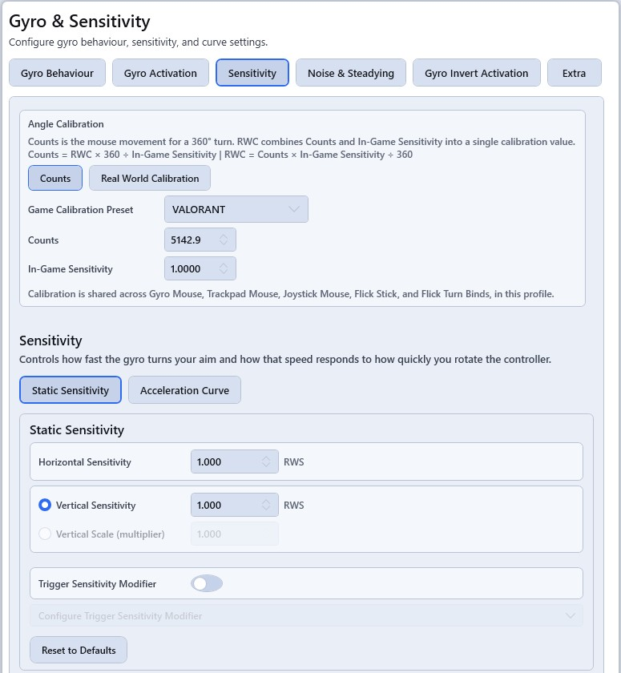

# DS4MapperTest

Fork of [archived DS4MapperTest](https://github.com/Ryochan7/DS4MapperTest), used as a testing ground for controller mapping ideas, binding behaviour, sensitivity settings, etc. The application currently supports the DualShock 4, DualSense, 8BitDo Ultimate 2 Wireless, Steam Controller 2015, Steam Controller 2026, JoyCon, and Switch Pro.

## Quick Start

- Download and run the installer: [Latest release](https://github.com/HelloHim/DS4MapperTest/releases/tag/v1.0.0-beta)
- Install the runtime dependencies listed below.
- Connect a supported controller.
- Launch `DS4MapperTest`.
- Select or create a profile.
- Configure the bindings and settings you want.
- Save the profile and start using it.

## Profile Storage

Profiles are saved under your Windows user profile, in `%APPDATA%\DS4Test\Profiles\`
(i.e. `C:\Users\<you>\AppData\Roaming\DS4Test\Profiles\`), in a subfolder per controller
type (`DualShock4`, `DualSense`, `SwitchPro`, `JoyCon`, `SteamController`,
`SteamControllerTriton`, `EightBitDoUlt2Wireless`). Each profile is a plain JSON file, so
back them up or move them between machines by copying that folder.

## Runtime Dependencies

- .NET 10 Desktop Runtime x64
  [https://dotnet.microsoft.com/en-us/download/dotnet/10.0](https://dotnet.microsoft.com/en-us/download/dotnet/10.0)
- Visual C++ 2015-2022 Redistributable x64
  [https://aka.ms/vs/17/release/vc_redist.x64.exe](https://aka.ms/vs/17/release/vc_redist.x64.exe)
- USBIP Driver 0.9.7.7 or later
  https://github.com/vadimgrn/usbip-win2
- libVIIPER is bundled with the application
  https://github.com/Alia5/VIIPER

### Optional Tools

- FakerInput 0.1.1
  Needed for the FakerInput mouse and keyboard output backend.
  https://github.com/Ryochan7/FakerInput/releases/download/v0.1.1/FakerInput_Setup_0.1.1_x64.msi
- HidHide
  For if you want to hide the physical controller while using a virtual output device.
  [https://docs.nefarius.at/projects/HidHide/Simple-Setup-Guide/](https://docs.nefarius.at/projects/HidHide/Simple-Setup-Guide/)

## Screenshots

### Binding workflow

### Mouse routing

### Gyro sensitivity and angle calibration

## Controller Compatibility

- DualShock 4
- DualSense
- DualSense Edge
- 8BitDo Ultimate 2 Wireless
- Steam Controller 2015
- Steam Controller 2026
- JoyCon
- Switch Pro

## Installation for Devs

- Install Visual Studio with the `.NET desktop development` workload.
- Install the `.NET 10 SDK`.
- Open `DS4MapperTest.sln`.
- Use the `x64` platform.
- Set `DS4MapperTest` as the startup project if you want to run the app directly.
- Restore NuGet packages before building.
- If you want to work on FakerInput-backed features, make sure the `FakerInputWrapper` dependency is available to the project.

## Acknowledgements

- GamepadMotionHelpers: Source of some ported gyro-related logic. MIT licensed.
  <https://github.com/JibbSmart/GamepadMotionHelpers/blob/master/LICENSE>
- JoyShockMapper: behavioural reference and source of some ported gyro-related logic. MIT licensed.
  <https://github.com/JibbSmart/JoyShockMapper/blob/master/LICENSE.md>
- JSM Custom Curve: UI inspiration.
  <https://github.com/evan1mclean/JSM_custom_curve>

## Licence

- GPL v3: [LICENSE.txt](LICENSE.txt)
